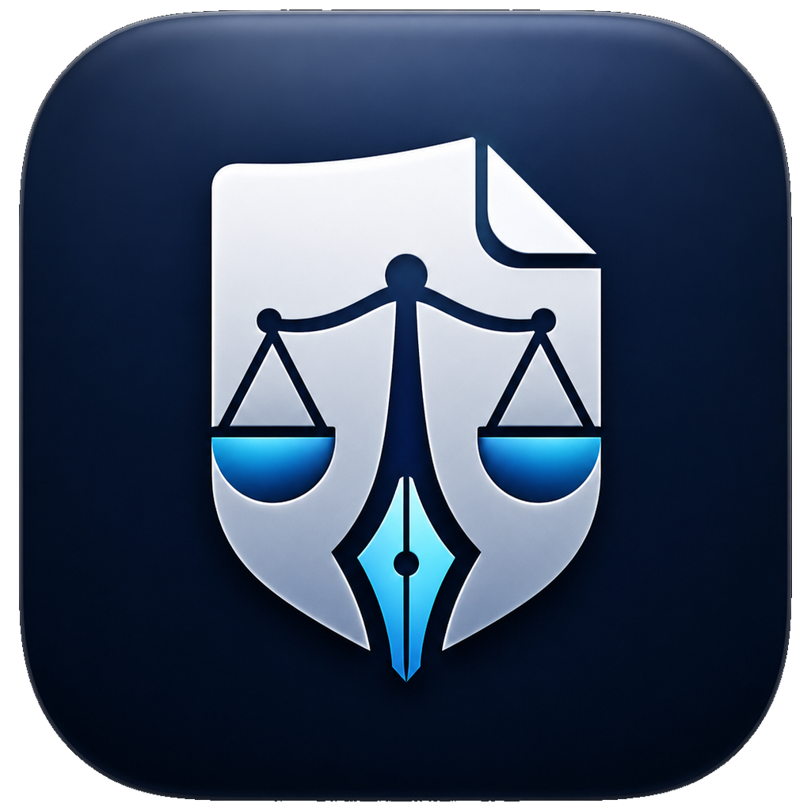

  

# تجهيز ملفات Word

تطبيق محمول لنظام **Windows 11 x64** يساعد على تجهيز ملفات **Word**.

## التنزيل

[تحميل أحدث إصدار](https://github.com/salmanhxm/session-minutes-portable/releases/latest)

فك ضغط الملف كاملًا، ثم شغّل `SessionMinutesPortable.exe`. لا يحتاج التطبيق إلى تثبيت.

## الاستخدام

1. اختر مجلد المشروع.
2. ابدأ الفحص والمعاينة.
3. راجع التقرير.
4. أنشئ الملفات المطلوبة.

يتطلب **Microsoft Word** لمراجعة الملفات الناتجة.

## الترخيص

[MIT License](LICENSE)

